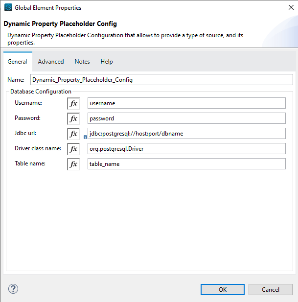

# Dynamic Property Placeholder Extension


## Description

The extension is used to dynamically load properties from a database (for now).

---

## Prerequisites

* The connector currently works with a specified schema which has a key column and a value column

| key                | value                |
|--------------------|----------------------|
| some_property_key  | some_property_value  |
| some_property_key  | some_property_value  |

The name of the table can be anything, but this has to be mentioned in the connector configuration.

* The connector (for this version) requires, database configuration such as
    * Username
    * Password
    * JDBC Url
    * Driver ClassName
    * Table Name
  
    
---
Add this dependency to your application pom.xml

```
<dependency>
    <groupId>org.mule.module</groupId>
    <artifactId>dynamic-property-placeholder</artifactId>
    <version>1.0.2</version>
    <classifier>mule-plugin</classifier>
</dependency>
```

---

## License

* Currently, this connector is not published to anypoint platform. It is a community connector and can be used by anyone
  provided they follow the Apache License 2.0 which is included in this project as LICENSE file.
* If anyone wants to modify this connector, please feel free to fork the repository and develop your own version of
  it. Please provide where you have forked the project from in you readme.


